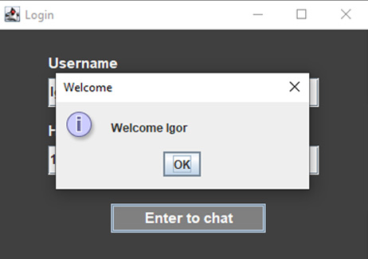
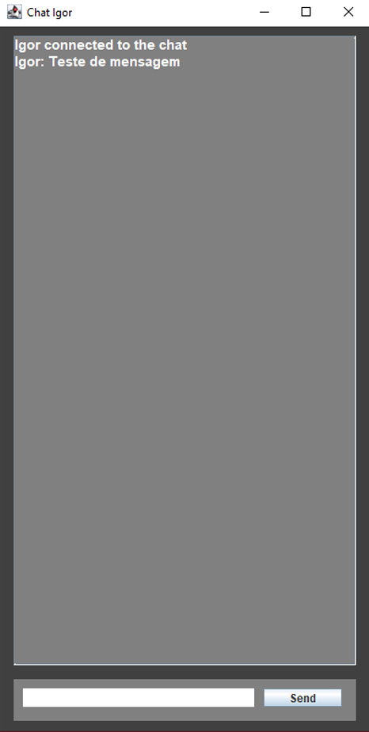

# Chat

O projeto se trata de um chat em java, que foi implementado utilizando socket e multithread para realizar a conexão servidor/cliente. Além disso, a interface gráfica foi implementada com o framework java swing.

## 🚀 Desenvolvimento

Descrição breve do desenvolvimento do projeto: 

Inicialmente foi criada toda a lógica de conexão entre servidor e cliente utilizando sockets e multithread. Com a conexão entre clientes e servidor estabelecida, precisavamos fazer com que as mensagens mandadas para o servidor fossem distribuidas para todos os clientes conectados. Toda essa distribuição é feita nas classes "Servidor.java", "Recebedor.java" e "TrataCliente.java".  
As seguintes responsabilidades foram atribuidas às classes "Servidor.java" e "Cliente.java": 
* Cliente/Client: Cada usuário criará uma instância do cliente e fará uma conexão com o servidor socket. O cliente deverá informar o endereço do server socket e a respectiva porta, por isso é necessário executar o Server.java antes.
* Servidor/Server:  servidor servirá como unidade centralizadora de todas as conexões recebidas via socket e terá como responsabilidade o envio de uma mensagem (recebida de um cliente) para todos os demais conectados no servidor. Quando um cliente se conecta a ele o mesmo cria uma Thread para aquele cliente, ou seja, cada conexão terá sua respectiva Thread e o servidor fará a gestão disso;

Após isso precisavamos implementar duas interfaces, utilizando java swing, uma de login onde o usuario deveria colocar seu nome e o ip do host, e a interface do chat de fato. Essas são as interfaces:
* Login:

* Chat:

## 📋 Como rodar

* Comece baixando o zip do projeto e extraia na sua máquina;
* Com isso feito, é importante ter certeza que os pré requisitos para se rodar uma aplicação em java sejam cumpridos (extensões e compiladores instalados);
* Para rodar dois clientes em uma mesma máquina é simples, é necessário apenas rodar o código do servidor e após isso rodar o dos clientes normalmente;
* Para rodar em máquinas diferentes é preciso rodar o servidor em uma delas e na outra é preciso, na tela de "login",  mudar o host para o ip da maquina que está rodando o servidor;

## 🛠️ Ferramentas

Lista de ferramentas usadas no desenvolvimento do projeto:

* [Java](https://docs.oracle.com/en/java/) - Linguagem utilizada;
* [Java swing](https://docs.oracle.com/javase/7/docs/api/javax/swing/package-summary.html) - Framework java utilizado;
* [Visual Studio code](https://code.visualstudio.com/docs) - IDE utilizada;

## ✒️ Autores

Integrantes do grupo de colaboradores:

* [Igor Barroso Almeida](https://github.com/IgorBarrosoAlmeida)
* [Leandro Rodrigues Marques](https://github.com/leandro-rodrigueds)
* [João Pedro Neffa](https://github.com/neffahr)
* [Eduardo Santos Evangelista](https://github.com/Eduardo1749)
